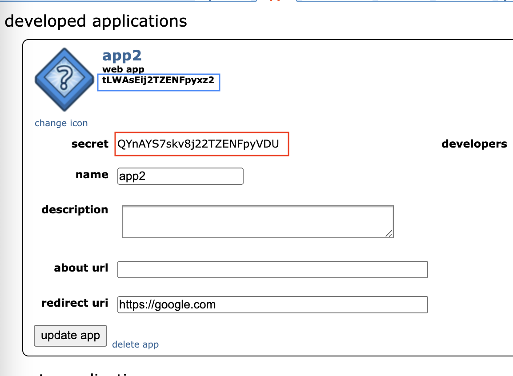
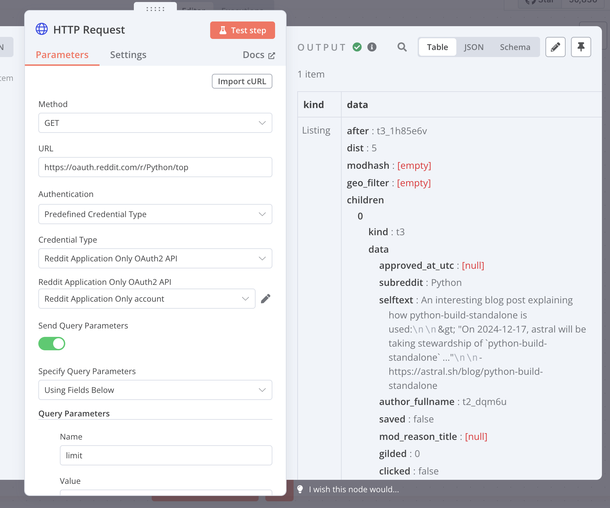
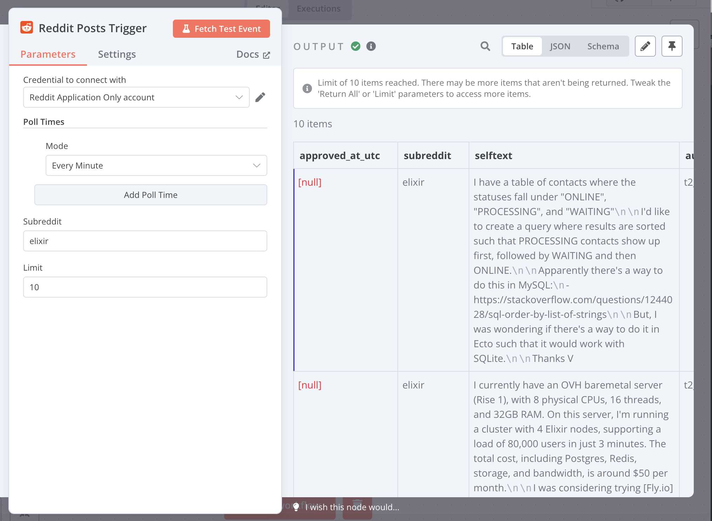

# n8n-nodes-userless-reddit

This n8n community node simplifies access to public Reddit data. Instead of relying on redirect URLs like the built-in Reddit OAuth2 node, this node uses a streamlined, application-only OAuth2 authentication flow (see [application-only OAuth](https://github.com/reddit-archive/reddit/wiki/OAuth2#application-only-oauth)). This "userless" approach is ideal for retrieving public information and avoids the complexity of OAuth callbacks. Use this credential with an [HTTP Request node](https://docs.n8n.io/integrations/builtin/core-nodes/n8n-nodes-base.httprequest) to interact with the Reddit API.

The package also provides a Reddit Posts Trigger node which triggers a workflow when new posts have been published in a subreddit. Compared to a normal RSS trigger, Reddit Posts Trigger retrieves data from API which has more information and is easier to process.

[n8n](https://n8n.io/) is a [fair-code licensed](https://docs.n8n.io/reference/license/) workflow automation platform.

- [Installation](#installation)
- [Credentials](#credentials)
- [Compatibility](#compatibility)
- [Usage](#usage)
- [Resources](#resources)

## Installation

Follow the [installation guide](https://docs.n8n.io/integrations/community-nodes/installation/) in the n8n community nodes documentation. In the GUI, install with the package name `n8n-nodes-userless-reddit`.

You can also install manually. Check [docker-compose.yaml](./docker-compose.yaml) for details

## Credentials

### Prerequisites

Go to https://www.reddit.com/prefs/apps and create an application. Choose type **web app** and fill **redirect uri** with a random URL. Then in the app page you will see the client id(blue) and client secret(red).

In the node "Reddit Application Only OAuth2 API". Fill in the Client ID and Client Secret from Reddit App and save the credentials.

## Compatibility

TODO

## Usage

### Make Requests to Reddit API

You can make authenticated HTTP request to Reddit using [HTTP request node](https://docs.n8n.io/integrations/builtin/core-nodes/n8n-nodes-base.httprequest/) and **Reddit Application Only OAuth2 API**. Simply add the credential to "authentication" section of HTTP request node.

### Reddit Posts Trigger

You should have a configured **Reddit Application Only OAuth2 API** to use the trigger. You can enter the subreddit, max number of posts to fetch each time and polling interval.

## Resources

- [n8n community nodes documentation](https://docs.n8n.io/integrations/community-nodes/)
- [Source](https://github.com/haohanyang/n8n-nodes-userless-reddit)
